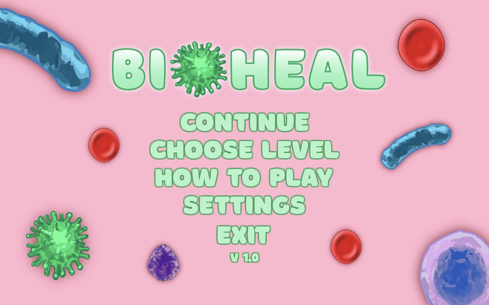

# Application name
Bioheal

# Full description (to 8000)
BioHeal is a strategy, in which you can take the lead in protecting the human body. Infections and toxins have entered the bloodstream, do not let them spread and get to the heart. Create erythrocytes, lymphocytes and granulocytes to protect your body and normalize blood metabolism.

The main task of the player is not to let the viruses destroy the heart and hold out all the infectious waves. The game takes place in the blood, the player must purify the blood from newly emerging infections and prevent them from destroying the heart.

The game is themed and, although it does not pretend to be reliable, many elements of biology are reflected correctly. Defensively, the player needs to create granulocytes and lymphocytes, which, indeed, are part of the human immune system and are engaged in the neutralization of harmful microorganisms and toxins.

To create friendly cells, the player needs minerals. Minerals are extracted by erythrocytes, which in turn can be destroyed by toxins.

Thus, the game is an interesting strategy with an unusual system of resource extraction and combat, illustrating the fight of the immune system with foreign bodies in the blood.

# Short description (to 80)
Rethinking the Tower Defense genre. Protect your heart from viruses.

# Icon

# Visual Materials

